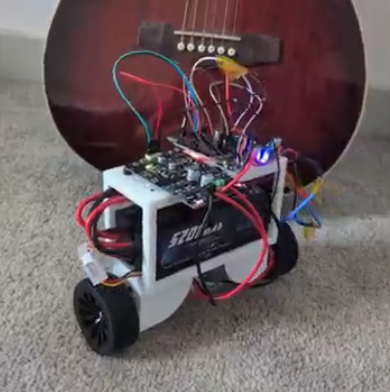

# Inverted Pendulum Balance Bot
 

## A self balancing bipedal wheeled bot 
Over my summer term, i wanted to learn how to actually build something. This doohickey is the product of 2 months of learning and trial and error

POST Build:
This project was my entryway to Engineering. I just wanted to quickly make a list of all of the topics I've learned over the course of ~2 months 
  - 3D modeling
  - 3D printing
  - PID
  - Control Theory 
  - Mechatronics 
  - Fighting the urge to slam the bot into the wall
  - Electrical Engineering

## What I Would Do Differently
If I built this again, I would start with:

- Motors with faster acceleration
- Encoders on both motors
- A motor driver selected before the mechanical design
- A more deliberate power distribution design
- A better-defined control architecture before tuning

## Biggest Hurdles
- PID
    - Seriosuly tuning PD was miserable
    - So much jitter
- Motor
    - Did not understand what stall current was at the start of the project. Immediately fried my first Motor Driver
    - Lack of Encoders
        - Was not able to determine how much my motors were actually turning. My Left motor needed 1.4v to start, while the right only needed 0.8v. They both spun at different speeds!!!
- Solder
    - Did NOT know about jump cables at first, so i was hand soldering EVERY DAMN WIRE

## Tools Used:
- FreeCad
- Arduino-Cli
- Orca-Slicer with PETG

## Resources Utilized
- [edX Mechatronics Course](https://www.edx.org/learn/engineering/the-georgia-institute-of-technology-the-mechatronics-revolution-fundamentals-and-core-concepts)
- [The Organic Chemist](https://www.youtube.com/@TheOrganicChemistryTutor)
- [Getting Started in Electronics](https://www.amazon.com/dp/0945053282)
###### P.S. The book is singlehandedly the most important part here

## Construction Materials
| Part    | Price    |
|--------------- | --------------- |
| [ESP32](https://www.amazon.com/dp/B08D5ZD528)   | $17 x1   |
| [MDD10A Driver](https://www.amazon.com/dp/B07CW34YRB)   | $23 x1   |
| [12V 300RPM Motor](https://www.amazon.com/dp/B072N84V8)   | $15 x2   |
| [MPU6050](https://www.amazon.com/dp/B00LP25V1A?th=1)   | $12 x1   |
| [S2](https://www.amazon.com/dp/B076Z778MJ) | $39 x2 |
| [Buck Converters](https://www.amazon.com/dp/B0DBVYP91F?th=1)| $8 x2 |
| [Heat Inserts] | N/A |

## General Overview
    1. Calibrate Gyro/Accel
    2. Pass MPU output to a Complimentary Filter
    3. Send output to a PD controller
    4. PD will convert error to PMW Signal for the motors
    5. Pray?

## Pinout

| Component | ESP32 Pin |
|---|---:|
| MPU6050 SDA | GPIO 21 |
| MPU6050 SCL | GPIO 22 |
| Motor A PWM | GPIO 25 |
| Motor A Direction | GPIO 33 |
| Motor B PWM | GPIO 32 |
| Motor B Direction | GPIO 26 |
| Status LED | GPIO 2 |

## If recreating this project:
Please remember to disable WIFI when actually tuning PD. If not, you start hammering your network
I have included the STL Files, print them o.2mm layers with 10ish slow layers to start with. This helps to make sure each screw hole isnt stringy
